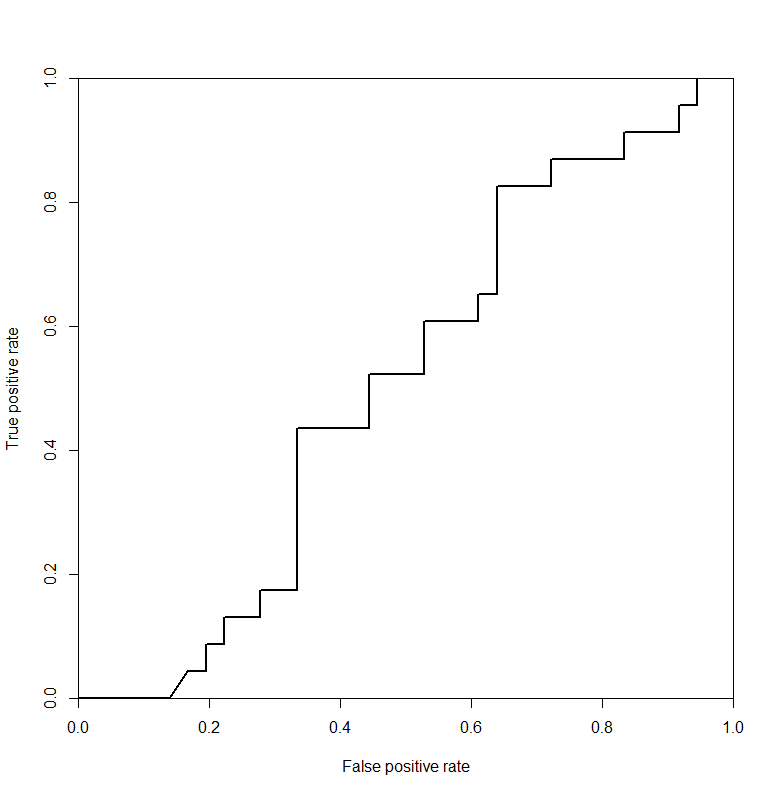

# savings-wealth-population-death-corruption-c02_emmissions
Find the relationship between a countries savings habit, wealth,population,death rate, corruption rate and c02 emissions. Is there any relationship between these parameters

## Process##
Data was downloaded from the [world bank](http://data.worldbank.org/) and [transperency.org](http://www.transparency.org/) into the data directory.

The file integrated_data.xlsx (modified/integrated_data.xlsx) contains formulas that extract data from all the files in the data directory into one file.
There are some countries that do not have any data point for some parameters so the would have to be taken out.
To do that, there is a python script in "code/python/script.py" that steps through a csv file and makes remove's any row that has ".." or "#N/A" in it. After all valid rows are extracted three files are created;
* "modified/integrated_data_cleaned_all.csv" - this has all the valid data extracted.
* "modified/integrated_data_cleaned_train.csv" - this has half of the cleaned data set to be used to train models
* "modified/integrated_data_cleaned_test.csv" - this has half of the cleaned data set to be used to test models generated

The R script in "code/r_code/script.R" uses the training data to generate a model and then tries to predict on the test data. It generates an ROC curve pictured below

Other analysis such as regression were done with excel and can found in "modified/data.xlsx"

##Result##
Based on the analysis done death rate and corruption do have a positive relationship, but the relationship is not a causality relationship. 
Unfortunately the model generated to try to predict corruption based on death rate was not very accurate as shown in the ROC curve above.
